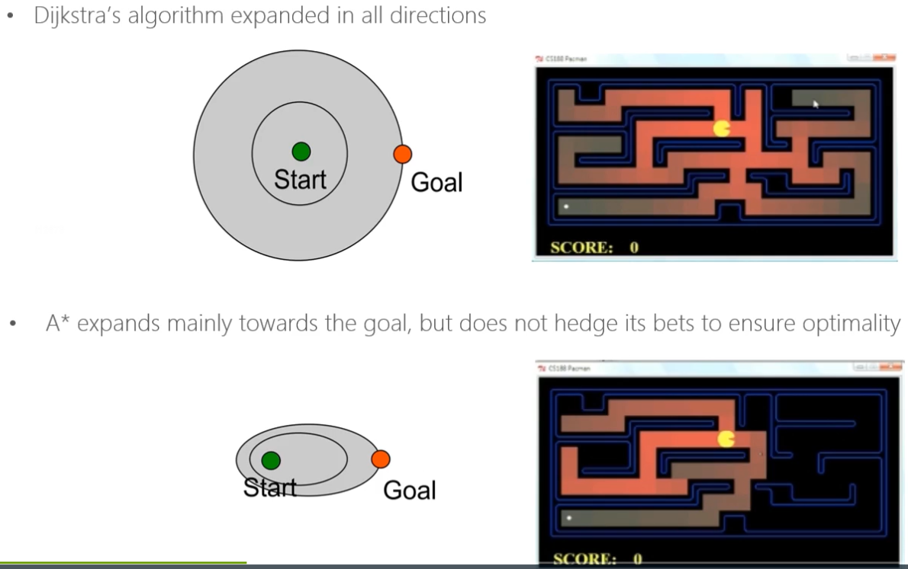
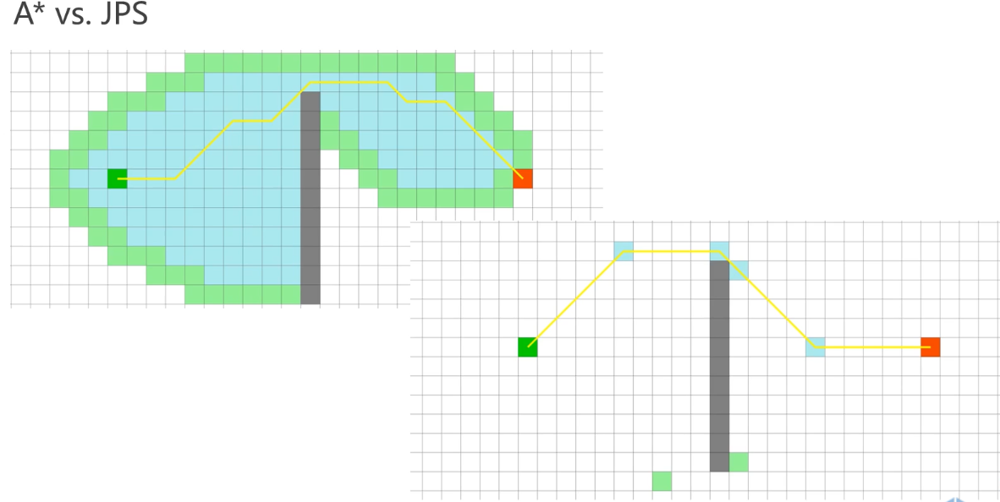
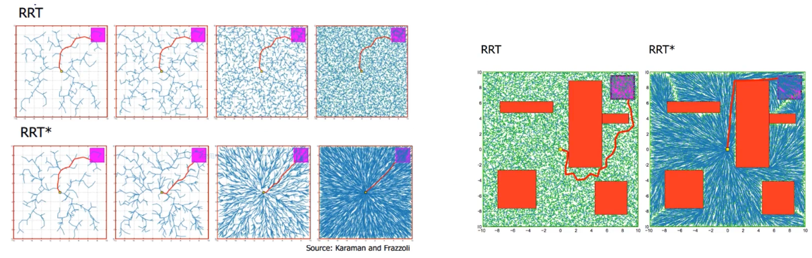
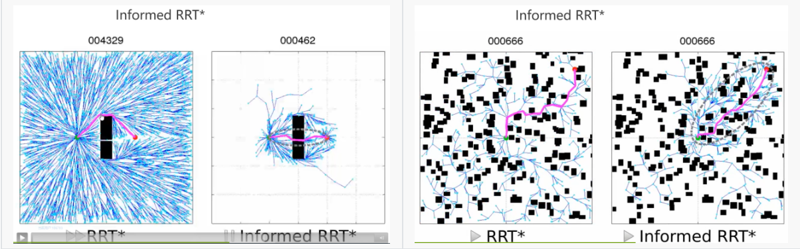

# 移动机器人

## 1.导论

### (1). Perception-Planning-Control action loop

-   Estimation: (location & status)
    -   Low latency
    -   High accuracy & consistency
-   Perception:
    -   Sensing
    -   Map fusion & integration
-   Planning
    -   Safety
    -   Dynamical feasibility
-   Control

### (2). Motion Planning

-   Requirements
    -   Safety
    -   Smoothness
    -   Kinodynamic feasibility
-   Pipeline
    -   Front-end: **Path** finding
        -   Low dimensional
        -   Discrete space
    -   Back-end: **Trajectory** generation
        -   High dimensional
        -   Continuous space

### (3). Front-end: Path Finding

#### ① Search-based Path Finding (Graph Search)

##### a. Dijkstra

##### b. A\*

##### c. Jump Point Search (JPS)

#### ② Sampling-based Path Finding (Probabilistic Road Map)

##### a. Rapidly-exploring Random Tree (RRT)

##### b. Optimal Sampling-based Methods (RRT\*)

##### c. Advanced Sampling-based Methods

#### ③ Kinodynamic Path Finding (Search-based or Sampling-based)

##### a. Basis: State-state Boundary Value Optimal Control Problem

##### b. State Lattice Search (离散化控制量生成 Graph + Graph Search in high dimensions)

##### c. Kinodynamic RRT\* （随机撒高位状态点？离散化状态量）

##### d. Hybrid A\* (每一个栅格里只维护一个状态，每个栅格里的状态总是保证路径的总代价最小)

### (4). Back-end: Trajectory Generation

#### ① Minimum Snap Trajectory Generation （从折线路径到动力学光滑轨迹？）

#### ② Soft and Hard Constrained Trajectory Optimization

### (5). MDP & MPC

#### ① Markov Decision Progress-based Planning

#### ② Model Predictive Control for Robotics Planning

### (6). Map

#### ① Occupancy Grid Map https://github.com/ANYbotics/grid_map

-   Most dense
-   Structural
-   Direct Index Query

后验概率 （建立概率栅格地图）：

贝叶斯滤波更新概率栅格地图：

初始化 l0=0，每一次观测都更新 lt，设置一个阈值 s，当 lt>s 时就认为该 grid 被占据

#### ② Octo-map (八叉树) https://octomap.github.io/

-   Sparse
-   Structural
-   Direct Index Query (间接的，通过树的结构递归的查询)

#### ③ Voxel Hashing (体素哈希表)

Map -> Bucket -> Blocks -> Voxel

-   Most sparse
-   Structural
-   Indirect Index Query

#### ④ Point Cloud Map (墙裂推荐 PCL 库：http://pointclouds.org/)

-   Unordered
-   No Index Query

#### ⑤ Truncated Signed Distance Functions (TSDF) Map (https://github.com/personalrobotics/OpenChisel) [截断距离场]

#### ⑥ Euclidean Signed Distance Functions Incremental Update, Global (ESDF) Map [欧式符号距离场] （VoxBlox: https://github.com/ethz-asl/voxblox; FIESTA: https://github.com/HKUST-Aerial-Robotics/FIESTA）

-   和占据栅格地图对比，ESDF 存在负值（障碍表面内部为负值，值的大小为到最近的 free 的栅格的距离，而 free 区域内存放的是正值）

-   建立方法
    -   从栅格地图增量
    -   从 TSDF 增量
    -   从栅格地图分批滚动建立（节省内存）

-   一维情况（下包络线：到最近障碍物的距离）

-   高维情况 [**个人理解高维情况可以做抛物面取最小包络面**]

#### ⑦ 拓扑地图，地图骨架（用于大型地图下的规划问题）

